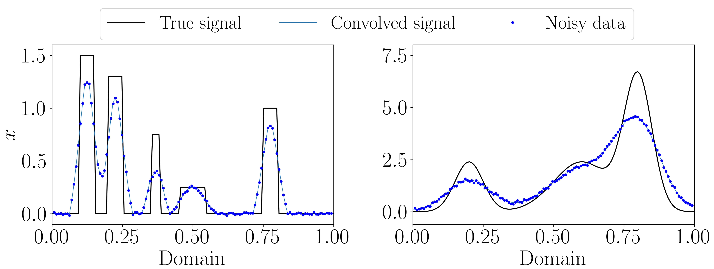

# Neural Network Priors for Bayesian Inverse Problems

## Overview

The repository contains implementation of the function space-based priors, so-called Bayesian neural network (BNN) priors. These priors use neural network structure as an approximation to the unknown function. Weights and biases of such networks are drown from some distributions rather than fixed, that is why these networks are also reffered to as _probabilistic_ neural networks. By changing the distribution on the network weights and biases, it is possible to alter the behaviour of the corresponding BNN prior. For example, if neural network parameters are distributed according to the Gaussian distribution, the realisations from the prior are smooth; whereas, if network parameters are drawn from the heavy-tailed Cauchy distribution, the realisations exhibit larger jumps (piecewise constant behavior). 

Like any other priors, BNN priors can be used for solving Bayesian inverse problems, where the quantity of interest needs to be reconstructed given its inderect (and often noisy) measurements. An example of an inverse problem is signal deconvolution, which we use to test the performance of BNN priors. We provide two test problems, the smooth and sharp signals, to illustrate the flexibility of the prior in promoting different types of behavior in the solution. Following the Bayesian approach to solving inverse problems, we model all the quantities as random, and the solution is found in the form of the _posterior_ distribution. Using the posterior distribution, we can obtain point estimates, for example, the maximum a posteriori (MAP) estimate. Alternatively, we can sample from the posterior distribution, using a Markov chain Monte Carlo algorithm, such as the Hamiltonian Monte Carlo (HMC) No-U-Turn Sampler (NUTS), to obtain so-called posterior mean estimate and also quantify the uncertainty, that is, estimate how reliable the obtained solution is. 

Codes are suplementary to Chapter 4 of Angelina Senchukova's doctoral thesis titled _"Flexible priors for rough feature reconstruction in Bayesian inversion”_ (the link to the electronic version of the thesis will be added once it is available online). 

## Installation 

Once the Python-3.8 virtual environment is created, all the required dependencies can be installed by running:
```shell
pip3 install -r requirements.txt
```

## Functionality description 

### Generating realizations from BNN priors 

Currently, the code supports one- and two-dimensional BNN priors with network parameters drawn from either Gaussian (smooth) or Cauchy (piecewise constant) distribution.
Realisations from BNN priors can be visualized by running: 
```shell
python3 generate_prior.py -d <distribution> -di <input_dimension>
```
Options for `<distribution>` are `gaussian` (_default_) or `cauchy`. Options for `<input_dimension>` are `1` (_default_, one-dimensional realisations, corresponding to signals) or `2` (two-dimensional realisations, corresponding to images).

Note: to check the comand line arguments and available choice for them, you can use `-h` option when calling the programm:
```shell
python3 generate_prior.py -h
```

For example, after running 
```shell
python3 generate_prior.py -d gaussian -di 1
```
the figures showing different one-dimensional realisations of Gaussian BNN priors (for various numbers of hidden layers and hidden units) will be saved to the directory named `./figures/priors/`. 

### Solving signal deconvolution problem using BNN priors 

We solve an inverse problem of recovering the unknown signal from its noisy convolved measurement data. We have two test problems: the sharp (piecewise constant) signal and smooth signal. 

<div align="center">
  
</div>

The solution to the problem can be obtained via: 
* MAP estimate or
* HMC NUTS producing a Markov chain approximating the true signal.

#### Computing MAP estimates 

To find **MAP estimates** for the solution using the optimization procedure, one should run 
```shell
python3 main_deconv_1d_compute_map.py -p <signal_type> -d <std_initialization_type> 
```
where:
- `<signal_type>` is either `smooth` (_default_) or `sharp`.
- Argument `<std_initialization_type>` defines how the standard deviation for the neural network parameters is initialized: 
  - if `exp` option is set (_default_, recommended choice), the standard deviation is initialized from the exponential distribution with some   predefined rate parameter.
  - if `const` option is passed, the unit (=1) standard deviation is used.

As a result of the programm run, we obtain 5 MAP estimates. The plot showing all MAP estimates (together with the true signal) will be saved as a pdf-figure to: `./results/<signal_type>_<std_initialization_type>_std/<act_function>_<num_hidden_nodes>_nodes/figures/map_estimates.pdf`

For example, by default the network contains 2 hidden layers with 40 and 80 nodes respectively, and the activation function is hyperbolic tangent. If the smooth signal is tested and the `exp` initialization is used for the standard deviation of the network parameters, then the figure path of the MAP estimates is 
`./results/smooth_exp_std/tanh_40_80_nodes/figures/map_estimates.pdf`.

**Note:** If the figure path does not exist, it will be created automatically. 

#### Running NUTS algorithm for sampling from the posterior distribution 

To obtain a solution using the **NUTS** algorithm, one should run 
```shell
python3 main_deconv_1d_run_nuts.py -s <sampler_start> -p <signal_type> -d <std_initialization_type> -ns <number_of_samples> -nb <burn-in> 
```
where:
* `<sampler_start>` stands for the starting point for NUTS. The starting point can be either `map` or `prior`. If `map` is choised the starting point for NUTS is the MAP estimate found previously. The program will automatically comute the best MAP estimated among all 5 estimates based on the relative reconstruction error between the true signal and MAP. Please note, that if you use MAP as a strating point you shoul precompute MAP estimates acoording to the instructions given above, otherwise you get an error message. 

  If `prior` is chosen, MAP is not needed, as the chain starting point will be randomly generated from the prior distribution on the network parameters (i.e. Gaussian distribution). 

  We recommend choosing MAP as a starting point for NUTS since it improves the sampler convergence.

* `<signal_type>` is either `smooth` or `sharp` depending on the problem you would like to test; _default_: `smooth`
* `<std_initialization_type>` reffers to the standard deviation initialization (defined as in the MAP estimate Section above); _default_: `exp`
* `<number_of_samples>` is the number of samples/states of the Markov chain to be generated by NUTS; _default_: 20 000. 
* `<burn-in>` is the length of the burn-in period specifying the number of additional states that will be generated at the beggining of the samplig procedure but later discarded in order to improve the chain convergence; _default_: 5 000.

For the default setting (smooth signal, Gaussian network with 40 and 80 hidden units and the tanh activation function, exponential initialization for the network parameters and MAP starting point), the results of the NUTS algorithm will be saved to: `./results/smooth_exp_std/tanh_40_80_nodes/nuts_map_start_20000_calls_5000_burn/nuts_results.pkl`. And the corresponding figure showing the posterior mean solution and highest density interval (uncertainty estimate) will be saved to the same path in the subdirectory named `figures`. 


